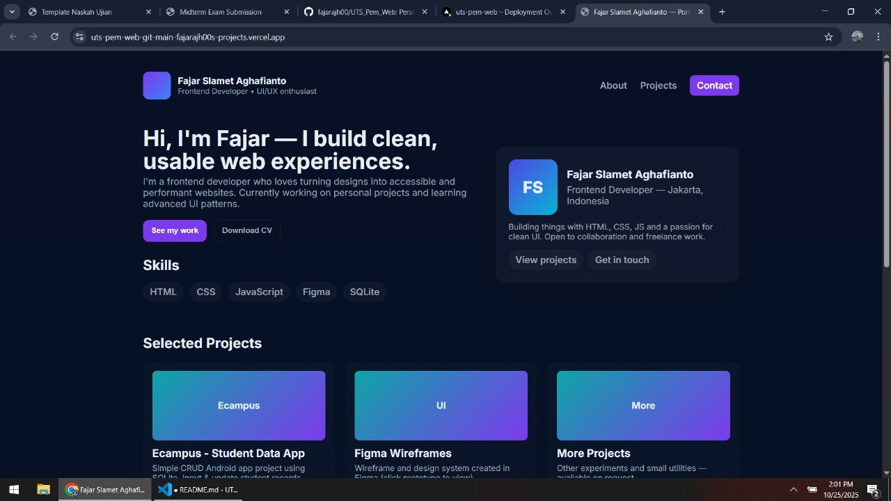

# 🌐 Fajar Slamet Aghafianto — Portfolio

Personal portfolio website built with **HTML, CSS, and JavaScript** to showcase my projects, skills, and experience as a Frontend Developer.

---

## 🚀 Features
- Responsive design using CSS Grid & Flexbox
- Smooth scrolling navigation
- Modern glassmorphism aesthetic
- Contact form layout
- Dynamic year in footer

---

## 🛠 Tech Stack
- **HTML5**
- **CSS3**
- **JavaScript (Vanilla)**

---

## 📁 Project Structure

---

## 🧑‍💻 Author
**Fajar Slamet Aghafianto**  
Frontend Developer • UI/UX Enthusiast  
📍 Jakarta, Indonesia  
📧 fajarsmt123@gmail.com

---

## 📸 Preview


---

## 💡 Setup
1. Clone repository:
   ```bash
   git clone https://github.com/fajarajh00/UTS_Pem_Web.git
